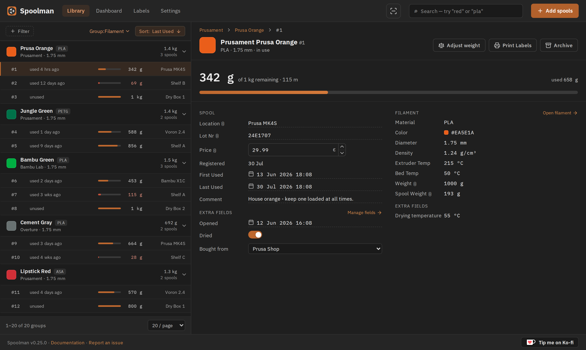
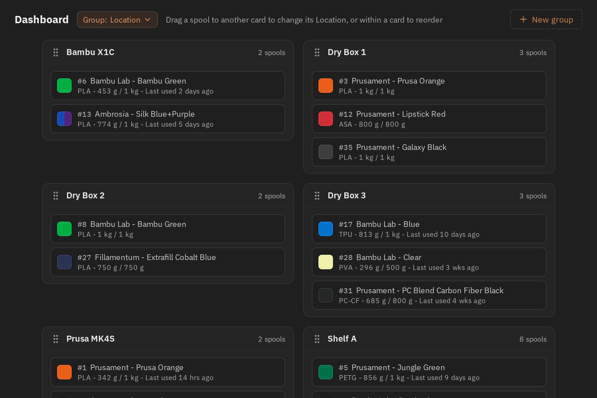
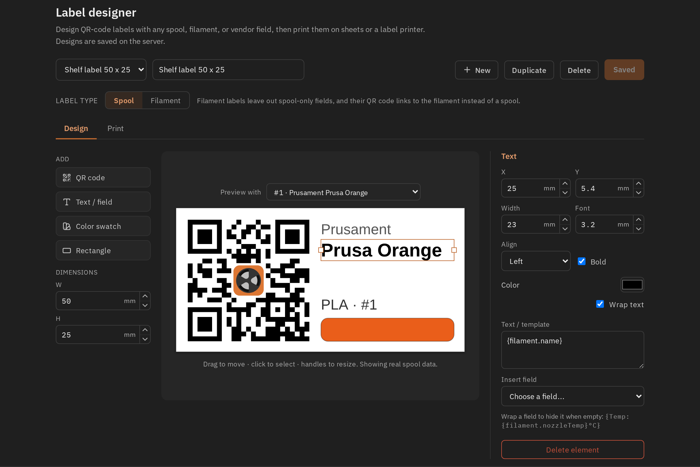

<picture>
  <source media="(prefers-color-scheme: dark)" srcset="https://github.com/Donkie/Spoolman/assets/2332094/4e6e80ac-c7be-4ad2-9a33-dedc1b5ba30e">
  <source media="(prefers-color-scheme: light)" srcset="https://github.com/Donkie/Spoolman/assets/2332094/3c120b3a-1422-42f6-a16b-8d5a07c33000">
  
</picture>

 

_Keep track of your inventory of 3D-printer filament spools._

Spoolman is a self-hosted web service designed to help you efficiently manage your 3D printer filament spools and monitor their usage. It acts as a centralized database that seamlessly integrates with popular 3D printing software like [OctoPrint](https://octoprint.org/) and [Klipper](https://www.klipper3d.org/)/[Moonraker](https://moonraker.readthedocs.io/en/latest/). When connected, it automatically updates spool weights as printing progresses, giving you real-time insights into filament usage.

### Features
* **Filament Management**: Keep comprehensive records of filament types, manufacturers, and individual spools.
* **API Integration**: The [REST API](https://donkie.github.io/Spoolman/) allows easy integration with other software, facilitating automated workflows and data exchange.
* **Real-Time Updates**: Stay informed with live spool updates through Websockets, providing immediate feedback during printing operations.
* **Central Filament Database**: A community-supported database of manufacturers and filaments simplify adding new spools to your inventory. Contribute by heading to [SpoolmanDB](https://github.com/Donkie/SpoolmanDB).
* **Web-Based Client**: Spoolman includes a built-in web client that lets you manage data effortlessly:
  * View, create, edit, and delete filament data.
  * Search, group and filter your inventory by manufacturer, material, location and more.
  * Add custom fields to tailor information to your specific needs.
  * Design and print labels with QR codes for easy spool identification and tracking.
  * Contribute to its translation into 18 languages via [Weblate](https://hosted.weblate.org/projects/spoolman/).
* **NFC Spool Identification**: Scan NFC tags to instantly identify and select spools. Supports three tag standards:
  * [TigerTag](https://tigertag.io/) (ISO 14443A / NTAG213) — binary format with external product database lookup.
  * [OpenPrintTag](https://openprinttag.org/) (ISO 15693 / NFC-V) — Prusa's NDEF/CBOR standard with per-spool UUIDs.
  * [Qidi](https://wiki.qidi3d.com/en/QIDIBOX/RFID) (ISO 14443A / MIFARE Classic 1K) — Qidi filament tags with material and color identification.
  * Browser-based NFC scanning via the Web NFC API, or server-side with a USB reader.
  * Automatic spool creation from tag data when scanning unrecognized tags.
  * External integration endpoint (`POST /api/v1/nfc/lookup`) for Klipper NFC daemons and other clients.
* **Database Support**: SQLite, PostgreSQL, MySQL, and CockroachDB.
* **Multi-Printer Management**: Handles spool updates from several printers simultaneously.
* **Advanced Monitoring**: Integrate with [Prometheus](https://prometheus.io/) for detailed historical analysis of filament usage, helping you track and optimize your printing processes. See the [Wiki](https://github.com/Donkie/Spoolman/wiki/Filament-Usage-History) for instructions on how to set it up.

**Spoolman integrates with:**
  * [Moonraker](https://moonraker.readthedocs.io/en/latest/configuration/#spoolman) and most front-ends (Fluidd, KlipperScreen, Mainsail, ...)
  * [OctoPrint](https://github.com/mdziekon/octoprint-spoolman)
  * [OctoEverywhere](https://octoeverywhere.com/spoolman?source=github_spoolman)
  * [Home Assistant](https://github.com/Disane87/spoolman-homeassistant)
  * [MCP Server](https://github.com/Disane87/spoolman-mcp) - Manage your filament inventory through AI assistants like Claude using the Model Context Protocol

**Web client preview:**

<table>
  <tr>
    <td width="50%"></td>
    <td width="50%"></td>
  </tr>
  <tr>
    <td align="center">Dashboard — spools as cards, grouped by location or any other field. Drag one to move it.</td>
    <td align="center">Label designer — QR labels built from any spool, filament or vendor field.</td>
  </tr>
</table>

## Installation
Please see the [Installation page on the Wiki](https://github.com/Donkie/Spoolman/wiki/Installation) for details how to install Spoolman.

If the new client misbehaves on your setup, set `SPOOLMAN_LEGACY_CLIENT=TRUE` to go back to
the previous one. Both ship in every release and talk to the same API, so your data is
untouched either way — but please [report the problem](https://github.com/Donkie/Spoolman/issues)
so it can be fixed.
